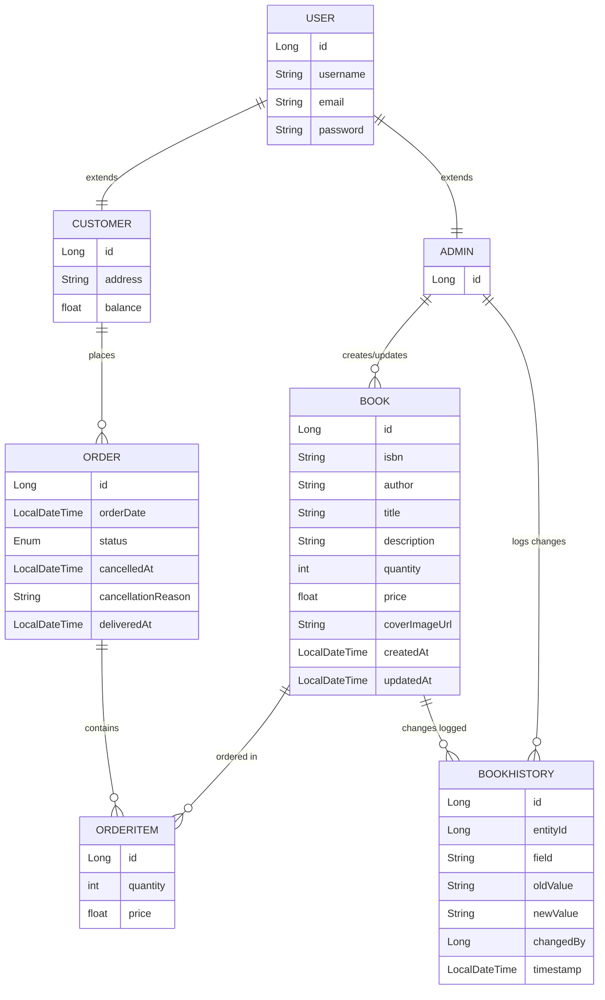
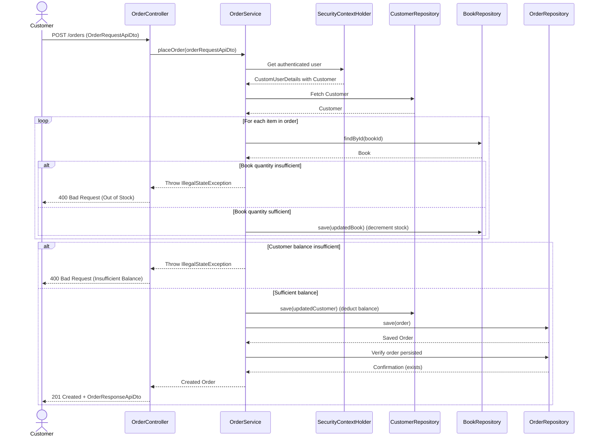
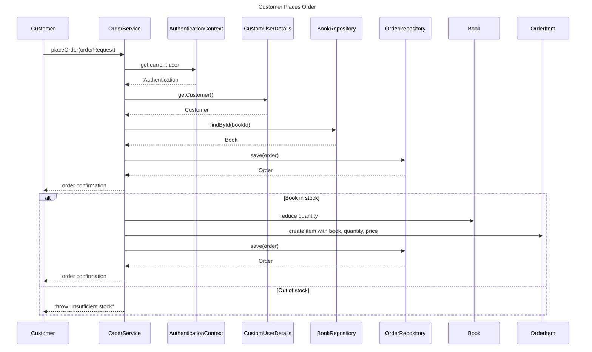
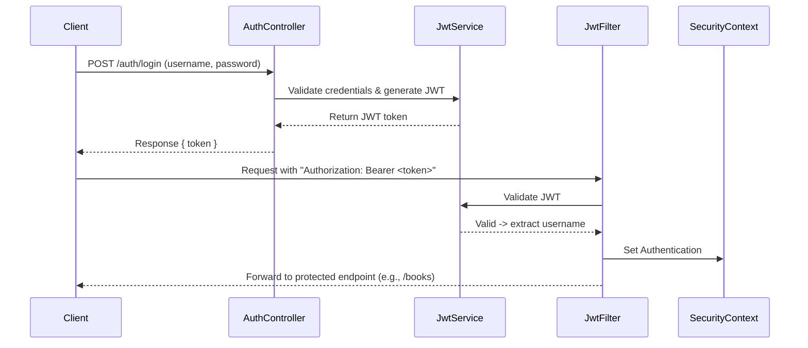

# 📚 Book Store Management System

The **Book Store Management System** is a backend application built with **Java** and **Spring Boot** that provides a secure and scalable way to manage a bookstore.

It covers the core workflows of a modern bookstore, including:
- 🔑 **Authentication & Authorization** with JWT
- 📖 **Book Management** (CRUD + history tracking)
- 🛒 **Order Management** (customers placing orders)
- 👥 **Customer Management**
- 📊 **OpenAPI 3.0.1** contract-first design

---

This project is designed with **RESTful API principles**, **Spring Security**, and **JPA/Hibernate** for database interaction.
It supports **in-memory H2** and uses **Liquibase** for database schema management.

Whether you are a **customer** browsing and purchasing books or an **admin** managing inventory and users, this system provides a structured and secure backend for bookstore operations.

[](https://www.oracle.com/java/)
[](https://spring.io/projects/spring-boot)

**Spring Boot–powered Book Store REST API** with JWT security, role-based access control, and full CRUD management of books, users, and orders.

---


# 📑 Table of Contents
1. [✨ Features](#-features)
2. [🛠️ Tech Stack](#️-tech-stack)
3. [🏗️ Architecture Overview](#️-architecture-overview)
    - [📘 Entity Relationship Diagram (ERD)](#-entity-relationship-diagram-erd)
    - [📘 Admin Updates Book (with History Tracking) Sequence Diagram](#-admin-updates-book-with-history-tracking-sequence-diagram)
    - [📗 Customer Places Order Sequence Diagram](#-customer-places-order-sequence-diagram)
5. [🚀 Getting Started](#-getting-started)
    - [⚙️ Setup](#️-setup)
    - [📌 Prerequisites](#-prerequisites)
6. [🔗 API Endpoints](#-api-endpoints)
7. [🔐 Authentication Flow](#-authentication-flow)
8. [🧪 Testing](#-testing)
9. [📂 Project Structure](#-project-structure)
10. [📜 OpenAPI Contract](#-openapi-contract)
11. [👥 Authors](#-authors)

---

# ✨ Features

- **Authentication & Authorization**
    - JWT-based stateless authentication
    - Role-based access (Admin vs Customer)
- **Book Management**
    - CRUD operations: add, update, delete, list books
- **Order Management**
    - Place orders and manage order details
- **User Management**
    - Registration, login, profile management
- **Documentation**
    - Integrated Swagger UI for interactive API exploration
- **Secure Password Storage**
    - Passwords hashed with BCrypt
- **Database Migrations**
    - **Liquibase** for version-controlled database schema management
- **Continuous Integration**
    - **GitHub Actions** for automated CI tests on push and pull requests

---
# 🛠️ Tech Stack

| Layer               | Technology                                     |
|---------------------|------------------------------------------------|
| Framework           | Spring Boot (REST API)                         |
| Security            | Spring Security with JWT                       |
| Persistence         | Spring Data JPA (H2 in-memory for development) |
| Database Migrations | Liquibase                                      |
| Build Tool          | Maven                                          |
| CI/CD               | GitHub Actions                                 |
| API Documentation   | Swagger UI                                     |


---

## 📝 User Stories

### 👤 Customer
- As a customer, I want to **register**, so that I can create an account and start using the bookstore.
- As a customer, I want to **log in**, so that I can securely access my account using JWT authentication.
- As a customer, I want to **browse all available books**, so that I can decide what to purchase.
- As a customer, I want to **search for a book by ISBN**, so that I can quickly find the book I want.
- As a customer, I want to **place an order**, so that I can buy books from the store.
- As a customer, I want the system to **validate stock when ordering**, so that I don’t purchase unavailable books.
- As a customer, I want to **view my past orders**, so that I can track my purchases.
- As a customer, I want to **cancel an order**, so that I can change my decision if needed.
- As a customer, I want my **password stored securely**, so that my account remains safe.

---

### 👨‍💼 Admin
- As an admin, I want to **add new books**, so that customers can purchase them.
- As an admin, I want to **update book details (with history tracking)**, so that all changes are audited.
- As an admin, I want to **delete books**, so that outdated or invalid books are removed.
- As an admin, I want to **upload a cover image for a book**, so that books have visual representation.
- As an admin, I want to **view all customers**, so that I can manage user accounts.
- As an admin, I want to **delete a customer**, so that I can remove inactive or problematic users.
- As an admin, I want to **view all orders**, so that I can track customer purchases.
- As an admin, I want to **update order status**, so that order progress (e.g., shipped, delivered) is reflected.
- As an admin, I want to **delete an order**, so that invalid orders are removed.
- As an admin, I want to **create new users with roles (customer or admin)**, so that I can manage staff and customer accounts.
- As an admin, I want to **log field updates of a book**, so that I can track who updated which detail.

---

### 🛡️ System (Technical/Non-Functional)
- As a system, I want to **authenticate users with JWT**, so that access is secure and stateless.
- As a system, I want to **enforce role-based access control**, so that customers and admins have different permissions.
- As a system, I want to **hash passwords with BCrypt**, so that no plain-text passwords are stored.
- As a system, I want to **provide API documentation via Swagger**, so that developers can easily test and integrate.
- As a system, I want to **provide an in-memory H2 database for development**, so that developers can test without external dependencies.

---


---

# 🏗️ Architecture Overview
## 📘 Entity Relationship Diagram (ERD)

The diagram below illustrates the **core data model** of the Book Store Management System:  

- **User Hierarchy**  
  - `USER` is a base entity representing authentication details (`username`, `email`, `password`).  
  - `ADMIN` and `CUSTOMER` both extend `USER`.  
    - **Admins** manage books and track updates.  
    - **Customers** place orders and maintain account balance and address.  

- **Books & History**  
  - `BOOK` stores details like ISBN, author, title, description, price, stock quantity, and timestamps.  
  - `BOOKHISTORY` records every change made to a book (old value → new value) along with the admin responsible, ensuring full **audit logging**.  

- **Orders & Items**  
  - `ORDER` represents a customer’s order, with fields for order date, status (e.g., pending, delivered, cancelled), cancellation reasons, and delivery info.  
  - Each order contains multiple `ORDERITEM`s, linking specific books with quantity and price at purchase time.  

- **Relationships**  
  - A **Customer places many Orders**.  
  - Each **Order contains multiple OrderItems**.  
  - A **Book can appear in multiple OrderItems**.  
  - A **Book’s changes are tracked in BookHistory**.  
  - An **Admin manages Books and logs changes**.  

This design ensures **data integrity**, **traceability of book updates**, and a clear separation between **users** and their roles (admin vs customer).  

---


## 📘 Admin Updates Book (with History Tracking) Sequence Diagram

When an Admin updates a book, the system first checks if the book exists. If found, it compares the old and new values, creates a BookHistory entry for audit purposes, saves it, and then updates the book record. If the book is not found, an exception is thrown.

## 📗 Customer Places Order Sequence Diagram
When a Customer places an order, the system validates the customer, checks if the book is available in stock, reduces the quantity, creates an OrderItem, and saves the order. If the book is out of stock, the system throws an exception.

---

# 🚀 Getting Started

## 📌 Prerequisites

- Java 17 (or above)
- Maven

## ⚙️ Setup

```bash
git clone [https://github.com/nourhammmad/Book-Store-System.git](https://github.com/nourhammmad/Book-Store-System.git)
cd Book-Store-System
```
# 🔗 API Endpoints

## 🔑 Authentication
| Method | Endpoint         | Description             | Access |
|--------|------------------|-------------------------|--------|
| POST   | `/auth/register` | Register a new customer | Public |
| POST   | `/auth/login`    | Authenticate & get JWT  | Public |

---

## 📚 Books
| Method | Endpoint                   | Description                        | Access   |
|--------|----------------------------|------------------------------------|----------|
| GET    | `/customer/book`           | Get all books (paginated)          | Customer |
| GET    | `/customer/book/{id}`      | Get book by ID                     | Customer |
| GET    | `/customer/book/isbn/{isbn}` | Get book by ISBN                  | Customer |
| POST   | `/admin/book`              | Create a new book                  | Admin    |
| DELETE | `/admin/book/{id}`         | Delete a book by ID                | Admin    |
| POST   | `/admin/book/{id}/cover`   | Upload a cover image for a book    | Admin    |

---

## 👤 Customers
| Method | Endpoint              | Description                   | Access |
|--------|-----------------------|-------------------------------|--------|
| GET    | `/admin/customer`     | Get all customers (paginated) | Admin  |
| GET    | `/admin/customer/{id}`| Get customer by ID            | Admin  |
| DELETE | `/admin/customer/{id}`| Delete customer by ID         | Admin  |

---

## 🛒 Orders
| Method | Endpoint                   | Description                           | Access   |
|--------|----------------------------|---------------------------------------|----------|
| GET    | `/admin/order`             | Get all orders (paginated)            | Admin    |
| GET    | `/admin/order/{id}`        | Get order by ID                       | Admin    |
| PATCH  | `/admin/order/{id}`        | Update order status                   | Admin    |
| DELETE | `/admin/order/{id}`        | Delete order by ID                    | Admin    |
| GET    | `/customer/order`          | Get all orders for logged-in customer | Customer |
| POST   | `/customer/order`          | Place a new order                     | Customer |
| PATCH  | `/customer/order/{id}`     | Cancel an order by ID                 | Customer |

---

## 👨‍💼 Admins
| Method | Endpoint                        | Description                   | Access |
|--------|---------------------------------|-------------------------------|--------|
| GET    | `/admin`                        | Get all admins (paginated)    | Admin  |
| GET    | `/admin/{id}`                   | Get admin by ID               | Admin  |
| DELETE | `/admin/{id}`                   | Delete admin by ID            | Admin  |
| POST   | `/admin/create-user`            | Create a new user with a role | Admin  |
| PATCH  | `/admin/book/{id}/update-field` | Log a book field update       | Admin  |

---

## 📂 Files
| Method | Endpoint            | Description                | Access |
|--------|---------------------|----------------------------|--------|
| GET    | `/files/{filename}` | Retrieve a book cover file | Auth   |
---

🔐 **Note:**  
- All **protected endpoints** require a valid JWT token in the `Authorization` header:  
# 🔐 Authentication Flow

This project uses **Spring Security + JWT (JSON Web Token)** for authentication and authorization. The flow ensures that only authenticated users can access protected endpoints while keeping the system stateless.

## 🔄 Flow Overview
1. **User Login**
    - A client sends login credentials (`username`, `password`) to `/auth/login`.
    - If valid, the server generates a **JWT token** and returns it to the client.

2. **Token Usage**
    - The client includes the JWT in the `Authorization` header for subsequent requests:
      ```
      Authorization: Bearer <jwt_token>
      ```

3. **JWT Filter Validation** (`JwtAuthenticationFilter`)
    - Every request passes through a filter that:
        - Extracts the token from the header.
        - Validates it with `JwtService`.
        - Loads user details via `UserDetailsServiceImpl`.
        - Creates a `UsernamePasswordAuthenticationToken` and sets it in `SecurityContextHolder`.

4. **Authorization**
    - `SecurityConfig` defines which endpoints are **public** (`/auth/**`, `/swagger-ui/**`, `/h2-console/**`) and which require authentication.
    - For protected endpoints, Spring Security checks the `SecurityContext` for valid authentication.

5. **Password Security**
    - Passwords are stored securely using **BCrypt hashing** (`BCryptPasswordEncoder`).

---

## ⚙️ Components Involved
- **`SecurityConfig`** → Defines security rules, session policy, and JWT filter chain.
- **`JwtAuthenticationFilter`** → Intercepts requests, validates JWTs, and authenticates users.
- **`CustomUserDetails`** → Wraps `User` entity to integrate with Spring Security.
- **`UserDetailsServiceImpl`** → Loads user data from the database.
- **`JwtService`** → Generates and validates JWT tokens.

---

# 📊 Authentication Flow Diagram

# 🧪 Testing

This project uses **JUnit 5** with **Mockito** for unit testing.
The service layer is fully covered by tests to ensure correctness and reliability.

## ✅ Test Coverage

- **BookServiceTest**
  - Get all books with pagination (valid, empty, invalid page/size, zero size, negative page)
  - Get book by ID (found, not found → EntityNotFoundException)
  - Create book (valid, with null fields)
  - Delete book (valid, non-existent → EntityNotFoundException)
  - Description retrieval (valid, empty string, not found → EntityNotFoundException)
  - Validation of arguments (illegal page number/size)

- **CustomerServiceTest**
  - Get all customers with pagination (valid, empty, large size, invalid page/size)
  - Find customer by ID (found, not found → EntityNotFoundException, null ID → IllegalArgumentException)
  - Delete customer (valid, null ID, non-existent, repository error)
  - Mapper behavior (successful mapping, mapper throwing RuntimeException)

- **OrderServiceTest**
  - Find all orders with pagination (valid, empty, invalid page/size)
  - Find order by ID (found, not found → IllegalArgumentException)
  - Place order:
    - Validates user existence (EntityNotFoundException)
    - Validates customer existence (EntityNotFoundException)
    - Validates book existence (IllegalArgumentException)
    - Validates quantities (zero, negative, excessive stock → IllegalArgumentException / IllegalStateException)
    - Validates balance (insufficient → IllegalStateException)
    - Validates items list (null or empty → IllegalArgumentException)
  - Delete order by ID:
    - Restores stock (single and multiple items)
    - Not found → EntityNotFoundException
  - Get previous orders (valid, empty)
  - Error scenarios (DB save not called when preconditions fail)
## Running Tests

Run all tests with Maven:

```bash
mvn test
```
# 📂 Project Structure

```
📦 book-store-app
├── 📂 .mvn
│   └── 📂 wrapper
│       └── 📄 maven-wrapper.properties
├── 📂 OpenAPI
│   ├── 📄 contract.yml
│   ├── 📄 examples.json
│   └── 📄 schemas.json
├── 📂 src
│   ├── 📂 main
│   │   ├── 📂 java
│   │   │   └── 📂 com
│   │   │       └── 📂 book
│   │   │           └── 📂 store
│   │   │               ├── 📂 config
│   │   │               │   ├── 📄 JwtAuthenticationFilter.java
│   │   │               │   └── 📄 SecurityConfig.java
│   │   │               ├── 📂 controller
│   │   │               │   ├── 📄 AdminController.java
│   │   │               │   ├── 📄 AuthController.java
│   │   │               │   ├── 📄 BookController.java
│   │   │               │   ├── 📄 CustomerController.java
│   │   │               │   ├── 📄 FileController.java
│   │   │               │   └── 📄 OrderController.java
│   │   │               ├── 📂 entity
│   │   │               │   ├── 📄 Admin.java
│   │   │               │   ├── 📄 Book.java
│   │   │               │   ├── 📄 BookHistory.java
│   │   │               │   ├── 📄 Customer.java
│   │   │               │   ├── 📄 Order.java
│   │   │               │   ├── 📄 OrderItem.java
│   │   │               │   └── 📄 User.java
│   │   │               ├── 📂 exception
│   │   │               │   ├── 📂 response
│   │   │               │   │   ├── 📄 ErrorDetails.java
│   │   │               │   │   ├── 📄 ValidationFailedResponse.java
│   │   │               │   │   └── 📄 ViolationErrors.java
│   │   │               │   └── 📄 MainExceptionHandler.java
│   │   │               ├── 📂 mapper
│   │   │               │   ├── 📄 AdminMapper.java
│   │   │               │   ├── 📄 BookMapper.java
│   │   │               │   ├── 📄 CustomerMapper.java
│   │   │               │   └── 📄 OrderMapper.java
│   │   │               ├── 📂 repository
│   │   │               │   ├── 📄 AdminRepository.java
│   │   │               │   ├── 📄 BookHistoryRepository.java
│   │   │               │   ├── 📄 BookRepository.java
│   │   │               │   ├── 📄 CustomerRepository.java
│   │   │               │   ├── 📄 OrderItemRepository.java
│   │   │               │   ├── 📄 OrderRepository.java
│   │   │               │   └── 📄 UserRepository.java
│   │   │               ├── 📂 security
│   │   │               │   └── 📄 CustomUserDetails.java
│   │   │               ├── 📂 seed
│   │   │               │   └── 📄 DataSeeder.java
│   │   │               ├── 📂 service
│   │   │               │   ├── 📄 AdminService.java
│   │   │               │   ├── 📄 AuthService.java
│   │   │               │   ├── 📄 AuthServiceImpl.java
│   │   │               │   ├── 📄 BookHistoryService.java
│   │   │               │   ├── 📄 BookService.java
│   │   │               │   ├── 📄 CustomerService.java
│   │   │               │   ├── 📄 JwtService.java
│   │   │               │   ├── 📄 JwtServiceImpl.java
│   │   │               │   ├── 📄 OrderService.java
│   │   │               │   └── 📄 UserDetailsServiceImpl.java
│   │   │               └── 📄 BookStoreApplication.java
│   │   └── 📂 resources
│   │       ├── 📂 db
│   │       │   └── 📂 changelog
│   │       │       ├── 📄 001-create-tables.yaml
│   │       │       ├── 📄 002-add-isbn.yaml
│   │       │       ├── 📄 003-add-order-and-book-fields.yaml
│   │       │       └── 📄 db.changelog-master.yaml
│   │       └── 📄 application.properties
│   └── 📂 test
│       └── 📂 java
│           └── 📂 com
│               └── 📂 book
│                   └── 📂 store
│                       ├── 📂 service
│                       │   ├── 📄 BookServiceTest.java
│                       │   ├── 📄 CustomerServiceTest.java
│                       │   └── 📄 OrderServiceTest.java
│                       └── 📄 BookStoreApplicationTests.java
├── 📄 .gitattributes
├── 📄 .gitignore
├── 📄 README.md
├── 📄 mvnw
├── 📄 mvnw.cmd
└── 📄 pom.xml

```
# 📜 OpenAPI Contract

This project follows a **contract-first** approach.
All API endpoints are defined in the OpenAPI specification:


## Code Generation

The project uses the [OpenAPI Generator Maven Plugin](https://openapi-generator.tech/docs/plugins/#maven) to generate API interfaces and DTOs automatically.

To generate code from the contract, run:

```bash
mvn clean compile
```
# 👥 Authors

## Nour Hammad
- GitHub: [@nourhammmad](https://github.com/nourhammmad)
---

## Shahd Ramzy
- GitHub: [@ShahdRamzy](https://github.com/ShahdRamzy)
---

## Mohamed Karam
- GitHub: [@Levii22](https://github.com/Levii22)
