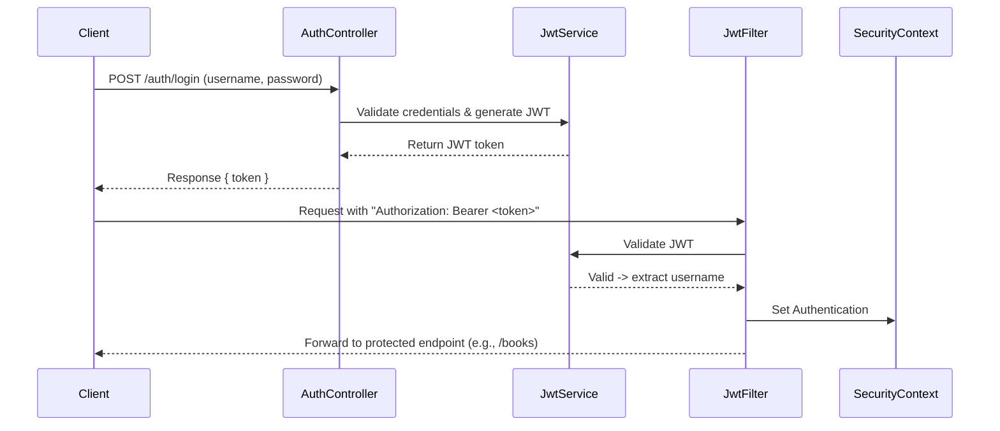

# 📚 Book Store Management System

The **Book Store Management System** is a backend application built with **Java** and **Spring Boot** that provides a secure and scalable way to manage a bookstore.  

It covers the core workflows of a modern bookstore, including:
- 🔑 **Authentication & Authorization** with JWT (Customers & Admins)  
- 📚 **Book Management** – add, update, view, and delete books  
- 👤 **Customer Management** – customer profiles & accounts  
- 🛒 **Order & Order Items** – place orders, track items status, manage inventory  

This project is designed with **RESTful API principles**, **Spring Security**, and **JPA/Hibernate** for database interaction.  
It supports **in-memory H2**.  

Whether you are a **customer** browsing and purchasing books or an **admin** managing inventory and users, this system provides a structured and secure backend for bookstore operations.

[](https://www.oracle.com/java/)
[](https://spring.io/projects/spring-boot)

**Spring Boot–powered Book Store REST API** with JWT security, role-based access control, and full CRUD management of books, users, and orders.

---

## 📑 Table of Contents  

1. [Features](#-features)  
2. [Technology Stack](#-technology-stack)  
3. [Getting Started](#-getting-started)  
4. [API Endpoints](#-api-endpoints)  
5. [Authentication Flow](#-authentication-flow)  
6. [Testing](#-testing)  
7. [Project Structure](#-project-structure)  
8. [OpenAPI Contract & Usage](#-openapi-contract--usage)  
9. [Authors](#-authors)  

---

##  Features

- **Authentication & Authorization**
  - JWT-based stateless authentication  
  - Role-based access (Admin vs Customer)
- **Book Management**
  - CRUD operations: add, update, delete, list books
- **Order Management**
  - Place orders and manage order details
- **User Management**
  - Registration, login, profile management
- **Documentation**
  - Integrated Swagger UI for interactive API exploration
- **Secure Password Storage**
  - Passwords hashed with BCrypt

---

##  Technology Stack

| Layer               | Technology                                      |
|--------------------|--------------------------------------------------|
| Framework           | Spring Boot (REST API)                           |
| Security            | Spring Security with JWT                         |
| Persistence         | Spring Data JPA (H2 in-memory for development)   |
| Build Tool          | Maven                                            |
| API Documentation   | Swagger UI                                       |

---

##  Getting Started

### Prerequisites

- Java 17 (or above)  
- Maven
## 📖 API Endpoints

### 🔑 Authentication
| Method | Endpoint         | Description              | Access |
|--------|------------------|--------------------------|--------|
| POST   | `/auth/register` | Register a new customer | Public |
| POST   | `/auth/login`    | Authenticate & get JWT  | Public |

---

### 📚 Books
| Method | Endpoint       | Description          | Access   |
|--------|----------------|----------------------|----------|
| GET    | `/books`       | Get all books        | Public   |
| GET    | `/books/{id}`  | Get book by ID       | Public   |
| POST   | `/books`       | Add a new book       | Admin    |
| PUT    | `/books/{id}`  | Update book details  | Admin    |
| DELETE | `/books/{id}`  | Delete a book        | Admin    |

---

### 👤 Customers
| Method | Endpoint           | Description               | Access   |
|--------|--------------------|---------------------------|----------|
| GET    | `/customers`       | Get all customers         | Admin    |
| GET    | `/customers/{id}`  | Get customer by ID        | Admin    |
| PUT    | `/customers/{id}`  | Update customer profile   | Customer |
| DELETE | `/customers/{id}`  | Delete customer account   | Admin    |

---

### 🛒 Orders
| Method | Endpoint           | Description               | Access   |
|--------|--------------------|---------------------------|----------|
| POST   | `/orders`          | Place a new order         | Customer |
| GET    | `/orders`          | Get all orders            | Admin    |
| GET    | `/orders/{id}`     | Get order by ID           | Customer/Admin |
| PUT    | `/orders/{id}`     | Update order status       | Admin    |
| DELETE | `/orders/{id}`     | Cancel an order           | Customer |

---


🔐 **Note:**  
- All **protected endpoints** require a valid JWT token in the `Authorization` header:  
## 5. 🔐 Authentication Flow

This project uses **Spring Security + JWT (JSON Web Token)** for authentication and authorization. The flow ensures that only authenticated users can access protected endpoints while keeping the system stateless.  

### 🔄 Flow Overview
1. **User Login**  
   - A client sends login credentials (`username`, `password`) to `/auth/login`.  
   - If valid, the server generates a **JWT token** and returns it to the client.  

2. **Token Usage**  
   - The client includes the JWT in the `Authorization` header for subsequent requests:  
     ```
     Authorization: Bearer <jwt_token>
     ```

3. **JWT Filter Validation** (`JwtAuthenticationFilter`)  
   - Every request passes through a filter that:  
     - Extracts the token from the header.  
     - Validates it with `JwtService`.  
     - Loads user details via `UserDetailsServiceImpl`.  
     - Creates a `UsernamePasswordAuthenticationToken` and sets it in `SecurityContextHolder`.  

4. **Authorization**  
   - `SecurityConfig` defines which endpoints are **public** (`/auth/**`, `/swagger-ui/**`, `/h2-console/**`) and which require authentication.  
   - For protected endpoints, Spring Security checks the `SecurityContext` for valid authentication.  

5. **Password Security**  
   - Passwords are stored securely using **BCrypt hashing** (`BCryptPasswordEncoder`).  

---

### ⚙️ Components Involved
- **`SecurityConfig`** → Defines security rules, session policy, and JWT filter chain.  
- **`JwtAuthenticationFilter`** → Intercepts requests, validates JWTs, and authenticates users.  
- **`CustomUserDetails`** → Wraps `User` entity to integrate with Spring Security.  
- **`UserDetailsServiceImpl`** → Loads user data from the database.  
- **`JwtService`** → Generates and validates JWT tokens.  

---


### 📊 Authentication Flow Diagram

## 🧪 Testing

This project uses **JUnit 5** with **Mockito** for unit testing.  
The service layer is fully covered by tests to ensure correctness and reliability.

### Test Coverage

- **BookServiceTest**
  - Get all books with pagination (valid, empty, invalid page/size)
  - Get book by ID (found / not found)
  - Create, update, and delete books
  - Handle null, zero, or invalid fields gracefully
  - Validate description retrieval logic

- **CustomerServiceTest**
  - Create customers (valid, null, empty fields, negative balance)
  - Get all customers with pagination (valid, empty, invalid page/size)
  - Find customer by ID (found, not found, null ID)
  - Delete customers (valid, non-existent, repository errors)
  - Mapper exception handling

- **OrderServiceTest**
  - Place orders from DTO (valid, multiple items, empty items, null items)
  - Stock quantity updates and validations (insufficient stock, exact stock, large orders)
  - Delete orders (restores stock, multiple items, repository errors)
  - Find orders (by ID, paginated, invalid page/size)
  - Error scenarios (missing customer, missing book, invalid quantities, DB failures)

### Running Tests

Run all tests with Maven:

```bash
mvn test

### Setup

```bash
git clone https://github.com/nourhammmad/Book-Store-System.git
cd Book-Store-System
```
### 📂 Project Structure

```
📦 book-store-app
├── 📂 .mvn
│   └── 📂 wrapper
│       └── 📄 maven-wrapper.properties
├── 📂 src
│   ├── 📂 main
│   │   ├── 📂 java
│   │   │   └── 📂 com
│   │   │       └── 📂 book
│   │   │           └── 📂 store
│   │   │               ├── 📂 Controller
│   │   │               │   ├── 📄 AdminController.java
│   │   │               │   ├── 📄 AuthController.java
│   │   │               │   ├── 📄 BookController.java
│   │   │               │   ├── 📄 CustomerController.java
│   │   │               │   └── 📄 OrderController.java
│   │   │               ├── 📂 Entity
│   │   │               │   ├── 📄 Admin.java
│   │   │               │   ├── 📄 Book.java
│   │   │               │   ├── 📄 BookHistory.java
│   │   │               │   ├── 📄 Customer.java
│   │   │               │   ├── 📄 Order.java
│   │   │               │   ├── 📄 OrderItem.java
│   │   │               │   └── 📄 User.java
│   │   │               ├── 📂 Mapper
│   │   │               │   ├── 📄 AdminMapper.java
│   │   │               │   ├── 📄 BookMapper.java
│   │   │               │   ├── 📄 CustomerMapper.java
│   │   │               │   └── 📄 OrderMapper.java
│   │   │               ├── 📂 Repository
│   │   │               │   ├── 📄 AdminRepository.java
│   │   │               │   ├── 📄 BookHistoryRepository.java
│   │   │               │   ├── 📄 BookRepository.java
│   │   │               │   ├── 📄 CustomerRepository.java
│   │   │               │   ├── 📄 OrderItemRepository.java
│   │   │               │   ├── 📄 OrderRepository.java
│   │   │               │   └── 📄 UserRepository.java
│   │   │               ├── 📂 Seed
│   │   │               │   └── 📄 DataSeeder.java
│   │   │               ├── 📂 Service
│   │   │               │   ├── 📄 AdminService.java
│   │   │               │   ├── 📄 AuthService.java
│   │   │               │   ├── 📄 AuthServiceImpl.java
│   │   │               │   ├── 📄 BookHistoryService.java
│   │   │               │   ├── 📄 BookService.java
│   │   │               │   ├── 📄 CustomerService.java
│   │   │               │   ├── 📄 JwtService.java
│   │   │               │   ├── 📄 JwtServiceImpl.java
│   │   │               │   ├── 📄 OrderService.java
│   │   │               │   └── 📄 UserDetailsServiceImpl.java
│   │   │               ├── 📂 config
│   │   │               │   ├── 📄 JwtAuthenticationFilter.java
│   │   │               │   └── 📄 SecurityConfig.java
│   │   │               ├── 📂 exception
│   │   │               │   ├── 📂 response
│   │   │               │   │   ├── 📄 ErrorDetails.java
│   │   │               │   │   ├── 📄 ValidationFailedResponse.java
│   │   │               │   │   └── 📄 ViolationErrors.java
│   │   │               │   └── 📄 MainExceptionHandler.java
│   │   │               ├── 📂 security
│   │   │               │   └── 📄 CustomUserDetails.java
│   │   │               └── 📄 BookStoreApplication.java
│   │   └── 📂 resources
│   │       └── 📄 application.properties
│   └── 📂 test
│       └── 📂 java
│           └── 📂 com
│               └── 📂 book
│                   └── 📂 store
│                       ├── 📂 Service
│                       │   ├── 📄 BookServiceTest.java
│                       │   ├── 📄 CustomerServiceTest.java
│                       │   └── 📄 OrderServiceTest.java
│                       └── 📄 BookStoreApplicationTests.java
├── 📄 .gitattributes
├── 📄 .gitignore
├── 📄 contract.yml
├── 📄 mvnw
├── 📄 mvnw.cmd
└── 📄 pom.xml
```
## 📖 OpenAPI Contract & Usage

This project follows a **contract-first** approach.  
All API endpoints are defined in the OpenAPI specification:


### Code Generation

The project uses the [OpenAPI Generator Maven Plugin](https://openapi-generator.tech/docs/plugins/#maven) to generate API interfaces and DTOs automatically.

To generate code from the contract, run:

```bash
mvn clean compile
## 👥 Authors

### Nour Hammad  
- GitHub: [@nourhammmad](https://github.com/nourhammmad)  
---

### Shahd Ramzy  
- GitHub: [@ShahdRamzy](https://github.com/ShahdRamzy)  
---

### Mohamed Karam  
- GitHub: [@Levii22](https://github.com/Levii22)  
