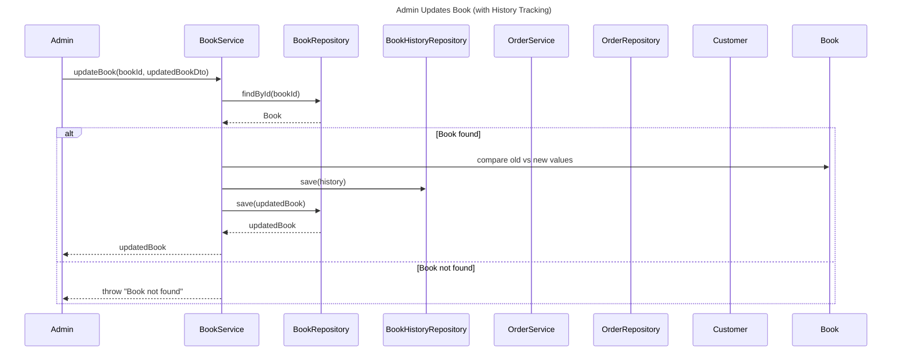
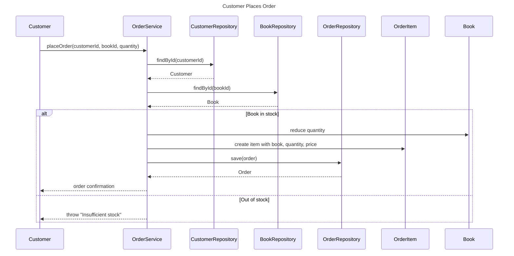

# 📚 Book Store Management System

The **Book Store Management System** is a backend application built with **Java** and **Spring Boot** that provides a secure and scalable way to manage a bookstore.  

It covers the core workflows of a modern bookstore, including:
- 🔑 **Authentication & Authorization** with JWT  
- 📖 **Book Management** (CRUD + history tracking)  
- 🛒 **Order Management** (customers placing orders)  
- 👥 **Customer Management**  
- 📊 **OpenAPI 3.0.1** contract-first design  

---

This project is designed with **RESTful API principles**, **Spring Security**, and **JPA/Hibernate** for database interaction.  
It supports **in-memory H2**.  

Whether you are a **customer** browsing and purchasing books or an **admin** managing inventory and users, this system provides a structured and secure backend for bookstore operations.

[](https://www.oracle.com/java/)
[](https://spring.io/projects/spring-boot)

**Spring Boot–powered Book Store REST API** with JWT security, role-based access control, and full CRUD management of books, users, and orders.

---


# 📑 Table of Contents
1. [✨ Features](#-features)  
2. [🛠️ Tech Stack](#️-tech-stack)  
3. [🏗️ Architecture Overview](#️-architecture-overview)  
   - [📘 Admin Updates Book (with History Tracking)](#-admin-updates-book-with-history-tracking)  
   - [📗 Customer Places Order](#-customer-places-order)  
4. [🚀 Getting Started](#-getting-started)  
   - [⚙️ Setup](#️-setup)  
   - [📌 Prerequisites](#-prerequisites)  
5. [🔗 API Endpoints](#-api-endpoints)  
6. [🔐 Authentication Flow](#-authentication-flow)  
7. [🧪 Testing](#-testing)  
8. [📂 Project Structure](#-project-structure)  
9. [📜 OpenAPI Contract](#-openapi-contract)  
10. [👨‍💻 Authors](#-authors)  


# ✨ Features

- **Authentication & Authorization**
  - JWT-based stateless authentication  
  - Role-based access (Admin vs Customer)
- **Book Management**
  - CRUD operations: add, update, delete, list books
- **Order Management**
  - Place orders and manage order details
- **User Management**
  - Registration, login, profile management
- **Documentation**
  - Integrated Swagger UI for interactive API exploration
- **Secure Password Storage**
  - Passwords hashed with BCrypt

---
# 🛠️ Technology Stack

| Layer               | Technology                                      |
|--------------------|--------------------------------------------------|
| Framework           | Spring Boot (REST API)                           |
| Security            | Spring Security with JWT                         |
| Persistence         | Spring Data JPA (H2 in-memory for development)   |
| Build Tool          | Maven                                            |
| API Documentation   | Swagger UI                                       |

---


# 🏗️ Architecture Overview
## 📘 Admin Updates Book (with History Tracking)

When an Admin updates a book, the system first checks if the book exists. If found, it compares the old and new values, creates a BookHistory entry for audit purposes, saves it, and then updates the book record. If the book is not found, an exception is thrown.

## 📗 Customer Places Order
When a Customer places an order, the system validates the customer, checks if the book is available in stock, reduces the quantity, creates an OrderItem, and saves the order. If the book is out of stock, the system throws an exception.

---

# 🚀 Getting Started

## Prerequisites

- Java 17 (or above)  
- Maven  

## ⚙️ Setup

```bash
git clone https://github.com/nourhammmad/Book-Store-System.git
cd Book-Store-System
```
# 📖 API Endpoints

## 🔑 Authentication
| Method | Endpoint         | Description             | Access |
| ------ | ---------------- | ----------------------- | ------ |
| POST   | `/auth/register` | Register a new customer | Public |
| POST   | `/auth/login`    | Authenticate & get JWT  | Public |

---

## 📚 Books
| Method | Endpoint            | Description                     | Access |
| ------ | ------------------- | ------------------------------- | ------ |
| GET    | `/book`             | Get all books (paginated)       | Public |
| GET    | `/book/{id}`        | Get book by ID                  | Public |
| GET    | `/book/isbn/{isbn}` | Get book by ISBN                | Public |
| POST   | `/book`             | Add a new book                  | Admin  |
| DELETE | `/book/{id}`        | Delete a book                   | Admin  |
| POST   | `/book/{id}/cover`  | Upload a cover image for a book | Admin  |


---

## 👤 Customers
| Method | Endpoint         | Description                   | Access |
| ------ | ---------------- | ----------------------------- | ------ |
| GET    | `/customer`      | Get all customers (paginated) | Admin  |
| GET    | `/customer/{id}` | Get customer by ID            | Admin  |
| DELETE | `/customer/{id}` | Delete customer account       | Admin  |

---

## 🛒 Orders
| Method | Endpoint             | Description                           | Access   |
| ------ | -------------------- | ------------------------------------- | -------- |
| GET    | `/admin/order`       | Get all orders (paginated)            | Admin    |
| GET    | `/admin/order/{id}`  | Get order by ID                       | Admin    |
| PUT    | `/admin/order/{id}`  | Update order status                   | Admin    |
| DELETE | `/admin/order/{id}`  | Delete order by ID                    | Admin    |
| POST   | `/order`             | Place a new order                     | Customer |
| POST   | `/order/{id}/cancel` | Cancel an order by ID                 | Customer |
| GET    | `/order/customer`    | Get all orders for logged-in customer | Customer |

---
## 👨‍💼 Admins
| Method | Endpoint                        | Description                   | Access |
| ------ | ------------------------------- | ----------------------------- | ------ |
| GET    | `/admin`                        | Get all admins (paginated)    | Admin  |
| GET    | `/admin/{id}`                   | Get admin by ID               | Admin  |
| DELETE | `/admin/{id}`                   | Delete admin by ID            | Admin  |
| POST   | `/admin/create-user`            | Create a new user with a role | Admin  |
| PATCH  | `/admin/book/{id}/update-field` | Log a book field update       | Admin  |

---
## 📂 Files
| Method | Endpoint            | Description                | Access |
| ------ | ------------------- | -------------------------- | ------ |
| GET    | `/files/{filename}` | Retrieve a book cover file | Public |

---

🔐 **Note:**  
- All **protected endpoints** require a valid JWT token in the `Authorization` header:  
# 🔐 Authentication Flow

This project uses **Spring Security + JWT (JSON Web Token)** for authentication and authorization. The flow ensures that only authenticated users can access protected endpoints while keeping the system stateless.  

## 🔄 Flow Overview
1. **User Login**  
   - A client sends login credentials (`username`, `password`) to `/auth/login`.  
   - If valid, the server generates a **JWT token** and returns it to the client.  

2. **Token Usage**  
   - The client includes the JWT in the `Authorization` header for subsequent requests:  
     ```
     Authorization: Bearer <jwt_token>
     ```

3. **JWT Filter Validation** (`JwtAuthenticationFilter`)  
   - Every request passes through a filter that:  
     - Extracts the token from the header.  
     - Validates it with `JwtService`.  
     - Loads user details via `UserDetailsServiceImpl`.  
     - Creates a `UsernamePasswordAuthenticationToken` and sets it in `SecurityContextHolder`.  

4. **Authorization**  
   - `SecurityConfig` defines which endpoints are **public** (`/auth/**`, `/swagger-ui/**`, `/h2-console/**`) and which require authentication.  
   - For protected endpoints, Spring Security checks the `SecurityContext` for valid authentication.  

5. **Password Security**  
   - Passwords are stored securely using **BCrypt hashing** (`BCryptPasswordEncoder`).  

---

## ⚙️ Components Involved
- **`SecurityConfig`** → Defines security rules, session policy, and JWT filter chain.  
- **`JwtAuthenticationFilter`** → Intercepts requests, validates JWTs, and authenticates users.  
- **`CustomUserDetails`** → Wraps `User` entity to integrate with Spring Security.  
- **`UserDetailsServiceImpl`** → Loads user data from the database.  
- **`JwtService`** → Generates and validates JWT tokens.  

---


# 📊 Authentication Flow Diagram

# 🧪 Testing

This project uses **JUnit 5** with **Mockito** for unit testing.  
The service layer is fully covered by tests to ensure correctness and reliability.

## ✅ Test Coverage

- **BookServiceTest**
  - Get all books with pagination (valid, empty, invalid page/size, zero size, negative page)
  - Get book by ID (found, not found → EntityNotFoundException)
  - Create book (valid, with null fields)
  - Delete book (valid, non-existent → EntityNotFoundException)
  - Description retrieval (valid, empty string, not found → EntityNotFoundException)
  - Validation of arguments (illegal page number/size)

- **CustomerServiceTest**
  - Get all customers with pagination (valid, empty, large size, invalid page/size)
  - Find customer by ID (found, not found → EntityNotFoundException, null ID → IllegalArgumentException)
  - Delete customer (valid, null ID, non-existent, repository error)
  - Mapper behavior (successful mapping, mapper throwing RuntimeException)

- **OrderServiceTest**
  - Find all orders with pagination (valid, empty, invalid page/size)
  - Find order by ID (found, not found → IllegalArgumentException)
  - Place order:
    - Validates user existence (EntityNotFoundException)
    - Validates customer existence (EntityNotFoundException)
    - Validates book existence (IllegalArgumentException)
    - Validates quantities (zero, negative, excessive stock → IllegalArgumentException / IllegalStateException)
    - Validates balance (insufficient → IllegalStateException)
    - Validates items list (null or empty → IllegalArgumentException)
  - Delete order by ID:
    - Restores stock (single and multiple items)
    - Not found → EntityNotFoundException
  - Get previous orders (valid, empty)
  - Error scenarios (DB save not called when preconditions fail)
## Running Tests

Run all tests with Maven:

```bash
mvn test
```
# 📂 Project Structure

```
📦 book-store-app
├── 📂 .mvn
│   └── 📂 wrapper
│       └── 📄 maven-wrapper.properties
├── 📂 OpenAPI
│   ├── 📄 contract.yml
│   ├── 📄 examples.json
│   └── 📄 schemas.json
├── 📂 src
│   ├── 📂 main
│   │   ├── 📂 java
│   │   │   └── 📂 com
│   │   │       └── 📂 book
│   │   │           └── 📂 store
│   │   │               ├── 📂 config
│   │   │               │   ├── 📄 JwtAuthenticationFilter.java
│   │   │               │   └── 📄 SecurityConfig.java
│   │   │               ├── 📂 controller
│   │   │               │   ├── 📄 AdminController.java
│   │   │               │   ├── 📄 AuthController.java
│   │   │               │   ├── 📄 BookController.java
│   │   │               │   ├── 📄 CustomerController.java
│   │   │               │   ├── 📄 FileController.java
│   │   │               │   └── 📄 OrderController.java
│   │   │               ├── 📂 entity
│   │   │               │   ├── 📄 Admin.java
│   │   │               │   ├── 📄 Book.java
│   │   │               │   ├── 📄 BookHistory.java
│   │   │               │   ├── 📄 Customer.java
│   │   │               │   ├── 📄 Order.java
│   │   │               │   ├── 📄 OrderItem.java
│   │   │               │   └── 📄 User.java
│   │   │               ├── 📂 exception
│   │   │               │   ├── 📂 response
│   │   │               │   │   ├── 📄 ErrorDetails.java
│   │   │               │   │   ├── 📄 ValidationFailedResponse.java
│   │   │               │   │   └── 📄 ViolationErrors.java
│   │   │               │   └── 📄 MainExceptionHandler.java
│   │   │               ├── 📂 mapper
│   │   │               │   ├── 📄 AdminMapper.java
│   │   │               │   ├── 📄 BookMapper.java
│   │   │               │   ├── 📄 CustomerMapper.java
│   │   │               │   └── 📄 OrderMapper.java
│   │   │               ├── 📂 repository
│   │   │               │   ├── 📄 AdminRepository.java
│   │   │               │   ├── 📄 BookHistoryRepository.java
│   │   │               │   ├── 📄 BookRepository.java
│   │   │               │   ├── 📄 CustomerRepository.java
│   │   │               │   ├── 📄 OrderItemRepository.java
│   │   │               │   ├── 📄 OrderRepository.java
│   │   │               │   └── 📄 UserRepository.java
│   │   │               ├── 📂 security
│   │   │               │   └── 📄 CustomUserDetails.java
│   │   │               ├── 📂 seed
│   │   │               │   └── 📄 DataSeeder.java
│   │   │               ├── 📂 service
│   │   │               │   ├── 📄 AdminService.java
│   │   │               │   ├── 📄 AuthService.java
│   │   │               │   ├── 📄 AuthServiceImpl.java
│   │   │               │   ├── 📄 BookHistoryService.java
│   │   │               │   ├── 📄 BookService.java
│   │   │               │   ├── 📄 CustomerService.java
│   │   │               │   ├── 📄 JwtService.java
│   │   │               │   ├── 📄 JwtServiceImpl.java
│   │   │               │   ├── 📄 OrderService.java
│   │   │               │   └── 📄 UserDetailsServiceImpl.java
│   │   │               └── 📄 BookStoreApplication.java
│   │   └── 📂 resources
│   │       ├── 📂 db
│   │       │   └── 📂 changelog
│   │       │       ├── 📄 001-create-tables.yaml
│   │       │       ├── 📄 002-add-isbn.yaml
│   │       │       ├── 📄 003-add-order-and-book-fields.yaml
│   │       │       └── 📄 db.changelog-master.yaml
│   │       └── 📄 application.properties
│   └── 📂 test
│       └── 📂 java
│           └── 📂 com
│               └── 📂 book
│                   └── 📂 store
│                       ├── 📂 service
│                       │   ├── 📄 BookServiceTest.java
│                       │   ├── 📄 CustomerServiceTest.java
│                       │   └── 📄 OrderServiceTest.java
│                       └── 📄 BookStoreApplicationTests.java
├── 📄 .gitattributes
├── 📄 .gitignore
├── 📄 README.md
├── 📄 mvnw
├── 📄 mvnw.cmd
└── 📄 pom.xml

```
# 📖 OpenAPI Contract & Usage

This project follows a **contract-first** approach.  
All API endpoints are defined in the OpenAPI specification:


## Code Generation

The project uses the [OpenAPI Generator Maven Plugin](https://openapi-generator.tech/docs/plugins/#maven) to generate API interfaces and DTOs automatically.

To generate code from the contract, run:

```bash
mvn clean compile
```
# 👥 Authors

## Nour Hammad  
- GitHub: [@nourhammmad](https://github.com/nourhammmad)  
---

## Shahd Ramzy  
- GitHub: [@ShahdRamzy](https://github.com/ShahdRamzy)  
---

## Mohamed Karam  
- GitHub: [@Levii22](https://github.com/Levii22)  
